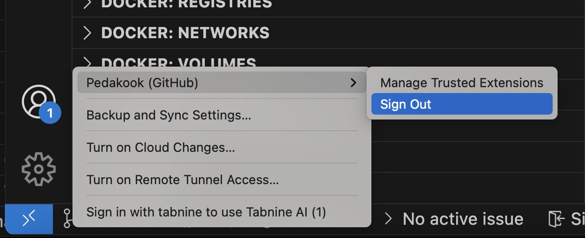

# Juhendid ja abimaterjalid  
## Sisukord
- [Juhendid ja abimaterjalid](#juhendid-ja-abimaterjalid)
  - [Sisukord](#sisukord)
  - [Tundide korraldus](#tundide-korraldus)
    - [Tunni alguse sissekanne](#tunni-alguse-sissekanne)
    - [Tunni lõpus](#tunni-lõpus)
  - [Git'i ja Githubi abi](#giti-ja-githubi-abi)
    - [Peamised git'i käsud](#peamised-giti-käsud)
## Tundide korraldus
Lisa iga tunni alguses ja lõpus oma meelestatus. lisa tunni lõpus ka pikem kommentaar tunni kohta.
Vaata siit:
### Tunni alguse sissekanne
Hinda 10-balli skaalal:
* Tänane tuju
* Huvi tunni vastu
* Arusaamine aine eesmärkidest

### Tunni lõpus
Hinda 10-balli skaalal:
* Tuju tunni lõpus
* Huvi teema vastu tunni lõpus
* Arusaamine tunni teemast tunni lõpuks
Lisaks kirjuta vabas vormis, mis meeldis, mis ei meeldinud, millele võiks rohkem tähelepanu pöörata.

Markdow failid nimetage alati nõnda – "tunni number-kuupäev-kuu.md"

Näide: [01-26-jaanuar.md](01-26-jaanuar.md)

## Git'i ja Githubi abi
Sageli juhtub kooli arvutites, et eelmine kasutaja ei ole oma Githubi kasutajat välja loginud. Sel juhul ei saa te oma githubi kontole terminali kaudu sisse. Esmalt logige ennast Visual Studio Code vasakul all nurgas oleva nupu kaudu välja, seejärel tehke terminalile igaks juhuks taaskäivitus ja seejärel logige sealt samast uuesti sisse.
 

Kui endiselt tekib probleeme proovida ka terminalis git'i kasutajanime muuta ja kontrollida, kas masinas on seadistatud globaalne git'i kasutaja.

Globaalse git'i kasutaja kontroll:  
`git config --global user.name`

Globaalse git'i kasutaja mahavõtmine:  
`git config --global --unset user.email`

Kasutaja määramine kohalikult:  
`git config user.name "SinuNimi"`  
`git config user.email "SinuEpost@example.com"`  

Klobaalset kasuta määramist arvutites, kus ka teised tööd teevad, pole vast mõistlik panna, kui just pärast kindlalt maha võtad.

### Peamised git'i käsud
Peamised git'käsud, mis tasub meie kursusel meelde jätta, on järgmised:  
Giti kloonimine oma masinasse:  
`git clone [sinurepositooriumi aadress]`  
Uuenduste allatõmbamine juba kloonitud reposse:  
`git pull`  
Tehtud muudatuste lisamine töökorraldusse:  
`git add .`  
Hetkeseisu salvestamine ja kommentaar tehtu kohta:  
`git commit -m "Kommentaar tehtud muudatuse kohta"`  
Muudatuste saatmine eemal asuvasse reposse:  
`git push`  

